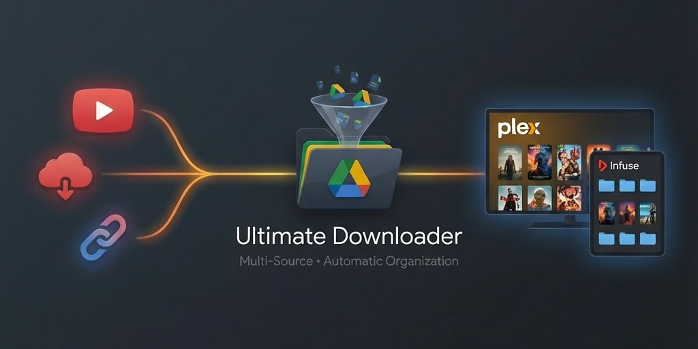

# Ultimate Downloader

Download videos and files in Google Colab, save them to Google Drive, and organise shows and movies for Plex. It supports Gofile, Pixeldrain, Mega, YouTube, TorBox, Real-Debrid, and many other sources.

**v7.0 is in preparation.** The last tagged release is v6.9. The next release adds links during a download, a clearer queue table, and better show and season names from TorBox folders. See the [v7.0 release notes](CHANGELOG.md#v70-unreleased).

## Get started

You need a Google account and enough space in Drive. A Real-Debrid or TorBox subscription is only needed for premium hosts and magnet links. A free TMDB key is optional for better movie and TV names.

1. Open [Google Colab](https://colab.research.google.com/) and create a new notebook.
2. Paste this into a cell and run it:

```python
import requests; exec(requests.get("https://raw.githubusercontent.com/xersbtt/ultimate-downloader-colab/main/ultimate_downloader.py").text)
```

3. Paste one link per line into **Links**.
4. Click **Resolve Links**, review the queue, then click **Start Download**. For a single link, **Quick Download** starts immediately.

The code runs in Colab; you do not need to install anything on your computer. Colab sessions can end unexpectedly, so use **Resume Previous Session** when you return.

> The command above runs code from this repository. You can [read the script](ultimate_downloader.py) first, or paste its contents directly into a Colab cell. To run a fixed release, replace `main` in the URL with a tag such as `v6.9`.

### Add your keys

Open **⚙️ Settings** to enter tokens, or save them in Colab's **Secrets** panel (the key icon). Secrets are read again each run and are not saved to Drive.

| Service | Secret name | When you need it |
| --- | --- | --- |
| Gofile | `GOFILE_TOKEN` | Private or account-linked Gofile downloads |
| Real-Debrid | `RD_TOKEN` | Premium hosts and magnets through Real-Debrid |
| TorBox | `TB_TOKEN` | Premium hosts, magnets, and TorBox links |
| TMDB | `TMDB_API_KEY` | Better names, years, anime routing, and season matching |
| FShare | `FSHARE_EMAIL` and `FSHARE_PASSWORD` | FShare VIP links |

Choose **Real-Debrid**, **TorBox**, or **None** with the **Debrid** selector. You can use YouTube, Mega, Gofile, Pixeldrain, and other public sources without a debrid subscription.

## Use the queue

**Resolve Links** shows the files before downloading. You can remove unwanted files, change their order, and see where each one will be saved. Click a row to select it, Shift-click to select a range, or use the checkbox at the top to select or clear all. Drag a column edge to resize the queue table.

After resolving, the Links field is ready for more URLs and the button becomes **Add Links**. This also works during a reviewed download: add links, review the new files, and click **Add to Download**. Downloads already in progress continue. TorBox files in folders such as Extras or Trailers appear in the queue but start unselected; select them if you want them.

Use **⏹ Stop Download** to save unfinished work for Resume. **🔁 Retry Failed** retries failures. For Quick Download or Resume, use Colab's **Runtime → Interrupt execution** to stop.

### Fix a name or destination

The queue previews each file's destination. If a name or episode number looks wrong, select the affected rows and use **Fix Match**, **Force Name / Year**, **Force Season**, **Renumber**, or **Route as**. Fill several fields and click **Apply Changes** to apply them together. Your choices are saved for Resume.

With a TMDB key, the downloader can find official names and years, match anime to the anime folders, and place high-numbered anime episodes in the right season. A manual **Route as** choice takes priority.

## Where files go

With **Auto-organise** on, TV episodes go to `My Drive/TV Shows`, movies to `My Drive/Movies`, and recognised anime to `My Drive/Anime Series` or `My Drive/Anime Movies`. YouTube videos without an episode pattern go to `My Drive/YouTube`. Turn Auto-organise off to keep original filenames in `My Drive/Downloads`.

You can change these folders in **⚙️ Settings**. Existing subtitles are kept with their videos. You can also extract text subtitles from videos after download or scan an existing Drive folder with **Extract from Library**.

RAR, ZIP, and 7Z archives are unpacked automatically. Files already downloaded are skipped when possible.

### Download and Drive settings

| Setting | What it does |
| --- | --- |
| **Parallel DLs** | Runs up to five supported downloads at once. Lower it if a provider limits connections. |
| **Auto Retry** | Retries failed files automatically after a batch. Leave it empty to turn it off. |
| **Upload to Drive via API** | Optional Drive transfer method that confirms the file is on Drive before reporting success. It may be faster for large batches. |
| **Overlap Drive moves with downloads** | Starts the next download while finished files move to Drive; uses more Colab disk space. |
| **Drive movers** | Controls how many Drive transfers run together when overlap is on. Most useful with the Drive API option. |

The downloader pauses new downloads when Colab's temporary disk runs low. If large files keep pausing, reduce **Parallel DLs** or **Drive movers**.

## Supported sources

- **Public links:** Gofile, Pixeldrain, direct HTTP, Mega, Archive.org, and more.
- **Video sites:** YouTube and playlists, OK.ru, Twitch, Vimeo, TikTok, Dailymotion, and SoundCloud.
- **Debrid links:** Real-Debrid and TorBox support magnet files and many premium file hosts. TorBox share links and JDownloader folder links are supported.
- **FShare:** File and folder links with a VIP account. This integration is experimental and may need updates when FShare changes its site. Resolving a single file uses your daily quota; browsing a folder does not.

For YouTube playlists, you can choose a range such as `1,3,5-10` and select subtitle languages in the queue. YouTube cookies for Premium or members-only videos can be uploaded in **⚙️ Settings**; this option is experimental.

## If something goes wrong

| Problem | Try this |
| --- | --- |
| Colab stopped or the download was interrupted | Run the script again and click **Resume Previous Session**. |
| Some files failed | Click **Retry Failed**. For a throttled provider, wait a little before retrying. |
| A file has the wrong name or folder | Check its queue destination and use **Force Name**, **Fix Match**, or **Route as**. |
| YouTube skips a video | Clear the YouTube archive in **⚙️ Settings**. If you uploaded cookies, try clearing them too. |
| A FShare login fails | Try resolving again; if it keeps failing, restart the Colab runtime and check your VIP account. |
| Drive transfers are slow or disk space is tight | Try **Upload to Drive via API**, or lower **Parallel DLs** and **Drive movers**. |

For full release history and detailed fixes, see [CHANGELOG.md](CHANGELOG.md).

## License and credits

[MIT License](LICENSE). Built with [yt-dlp](https://github.com/yt-dlp/yt-dlp), [aria2](https://aria2.github.io/), and [megatools](https://megatools.megous.com/). This product uses the TMDB API but is not endorsed or certified by TMDB.
