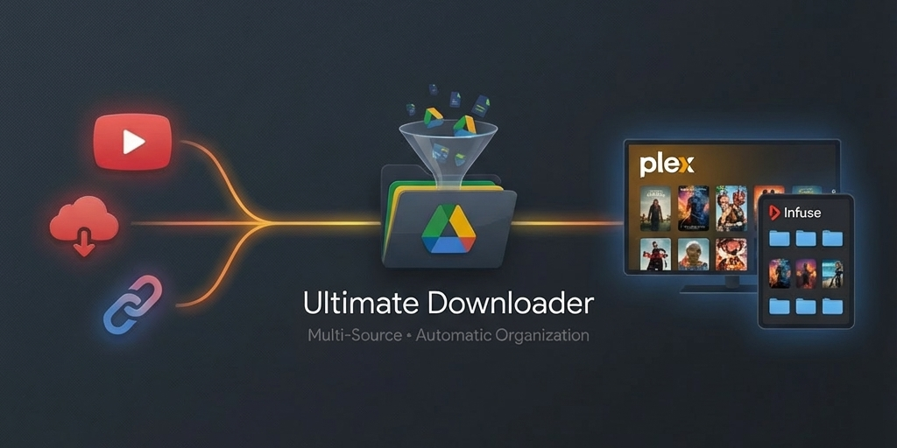

# Ultimate Downloader

Download videos and files in Google Colab, save them to Google Drive, and organise shows and movies for Plex. It supports Gofile, Pixeldrain, Mega, YouTube, TorBox, Real-Debrid, PikPak, Châu Thành donor links, and many other sources.

**Version 7.2** adds experimental Châu Thành donor downloads, alternate episode orders, and transfer fixes for PikPak and TorBox. See the [v7.2 release notes](CHANGELOG.md#v72).

## What's new in v7.2

- **Châu Thành donor downloads** reuse your PC supporter session in Colab and support up to three simultaneous `eri2` files with five connections each.
- **Alternate TMDB episode orders** map absolute-numbered downloads to a chosen season split and show the resulting paths in the queue.
- **Transfer fixes** keep PikPak recovery active on alternate CDN hosts and correct TorBox WebDL submission and polling.

## Get started

You need a Google account and enough space in Drive. A Real-Debrid or TorBox subscription is only needed for premium hosts and magnet links. A free TMDB key is optional for better movie and TV names.

1. Open [Google Colab](https://colab.research.google.com/) and create a new notebook.
2. Paste this into a cell and run it:

```python
import requests; exec(requests.get("https://raw.githubusercontent.com/xersbtt/ultimate-downloader-colab/main/ultimate_downloader.py").text)
```

3. Paste one link per line into **Links**.
4. Click **Resolve Links**, review the queue, then click **Start Download**. For a single link, **Quick Download** starts immediately.

The code runs in Colab; you do not need to install anything on your computer. Colab sessions can end unexpectedly, so use **Resume Previous Session** when you return.

> The command above runs code from this repository. You can [read the script](ultimate_downloader.py) first, or paste its contents directly into a Colab cell. To run a fixed release, replace `main` in the URL with a [published release tag](https://github.com/xersbtt/ultimate-downloader-colab/releases).

### Add your keys

Open **⚙️ Settings** to enter tokens, or save them in Colab's **Secrets** panel (the key icon). Secrets are read again each run and are not saved to Drive.

| Service | Secret name | When you need it |
| --- | --- | --- |
| Gofile | `GOFILE_TOKEN` | Private or account-linked Gofile downloads |
| Real-Debrid | `RD_TOKEN` | Premium hosts and magnets through Real-Debrid |
| TorBox | `TB_TOKEN` | Premium hosts, magnets, and TorBox links |
| PikPak | `PIKPAK_TOKEN` | PikPak shares and files in your own PikPak account |
| TMDB | `TMDB_API_KEY` | Better names, years, anime routing, and season matching |
| FShare | `FSHARE_EMAIL` and `FSHARE_PASSWORD` | FShare VIP links |
| Châu Thành | `CHAUTHANH_PHPSESSID` | Reuse your PC supporter login without installing a Colab browser |

Choose **Real-Debrid**, **TorBox**, or **None** with the **Debrid** selector. You can use YouTube, Mega, Gofile, Pixeldrain, and other public sources without a debrid subscription.

### PikPak setup

1. In PikPak, open **Account & Security → Connected Apps → Personal Access Tokens**, then create a token with **Read files** and **Manage files** permissions. See [PikPak's token setup guide](https://mypikpak.com/en-US/help-center/connected_apps/personal_access_tokens/create_personal_access_token).
2. Save the token in Colab Secrets as `PIKPAK_TOKEN`, or enter it in **⚙️ Settings → PikPak Account**. Your token is not saved to Google Drive or passed to the download server.
3. Paste a `https://mypikpak.com/s/...` share link into **Links**, then click **Resolve Links**. Nested folder links browse that folder; root share links include all its folders. Review the queue before starting a large share.
4. Select the files you want and click **Start Download**. Only selected shared files are saved to your PikPak account, and existing Google Drive files are skipped before saving. The downloaded originals use the same organisation and Drive transfer settings as other sources.

Files you already own are reused without creating another account copy. PikPak transfers start with up to four connections per file. If the server closes the connection early (`Got EOF from the server`) or returns a temporary server error, the downloader waits 15, 30, then 60 seconds, requests a fresh link, and resumes the partial file with one connection. These errors share a limit of three recovery waits per file. Failed files show a readable reason, with tokens and signed URLs hidden.

The official PikPak client installs automatically in the Colab runtime on first use. This integration works independently of the **Debrid** selector. It also accepts `pikpak://folder/FOLDER_ID`, `pikpak://file/FILE_ID`, and PikPak `drive/all` URLs with a `parent_id`. For a protected share, append `?pass_code=CODE` to its link (URL-encode the code if it contains special characters).

**Resume Previous Session** and **Retry Failed** reuse saved PikPak file IDs and pending save references, and request fresh download links. If PikPak is still saving a selected file, retry shortly. Saved copies stay in your PikPak account; remove them there when you no longer need them. Account storage and transfer limits apply; check [PikPak's current connected-app limits](https://mypikpak.com/en-US/connect-apps-faq).

### Châu Thành donor downloads

**Experimental.** A Colab download-to-Drive batch completed using a PC supporter session with the earlier two-file allocation. This route runs without a browser in Colab.

1. Sign into your supporter account normally in your PC browser.
2. In developer tools (F12), open **Application → Cookies → chauthanh.info** in Chrome/Edge, or **Storage → Cookies → chauthanh.info** in Firefox/Mullvad. Copy the **Value** of `PHPSESSID`.
3. In **Settings → Châu Thành donor account → PC session**, paste that value and click **Use PC login**. Alternatively, use Colab Secret `CHAUTHANH_PHPSESSID`. No username/password is needed for this route.
4. Paste donor file links into **Links**, click **Resolve Links**, then **Start Download**. The Debrid selector does not affect this source.

The value is a login credential: enter it only into the masked field or your private Colab Secret. The downloader shares one in-memory session across workers and rechecks supporter permission after five minutes or a donor refusal. It does not save the value or cookies in Drive settings, history or queues. When the session is no longer accepted, copy the current value from your signed-in PC browser. This route does not fall back to password submission. A new login elsewhere can replace the active session under the site's [single-login rule](https://chauthanh.info/compare.html).

Accepted links contain `/download/eri2/`, or point directly to `eri2.chauthanh.info`, including the observed `download.php?id=…&file=…&name=…` redirect. If the site offers **Queue all**, copy its generated donor file links into the same field. Show-page browsing, other `eri` servers and free downloads remain unsupported.

Up to three donor files at once use five connections each (15 total), within the site's [stated 16 download threads](https://chauthanh.info/compare.html). Workers check for Drive duplicates first, verify supporter permission, repeat the site's normal `/ip` status request, then check file access without account cookies as aria2 will download. Only the file range establishes download permission. The check recognises IP allow-list refusals even with HTTP 200. Completed files must match the verified expected size before Drive processing. Retry and Resume reuse the runtime session and original donor link. An expired signed link still requires a fresh link; signed input links remain in the saved queue for Resume and should be kept private.

**Other login options** in Settings retains the fresh HTTP login and optional runtime browser. The fresh HTTP test returned “Confirmation code is not correct!” The browser path lets you complete verification on the runtime and still needs a successful live login test.

## Use the queue

**Resolve Links** shows the files before downloading. You can remove unwanted files, change their order, and see where each one will be saved. Click a row to select it, Shift-click to select a range, or use the checkbox at the top to select or clear all. Drag a column edge to resize the queue table.

After resolving, the Links field is ready for more URLs and the button becomes **Add Links**. This also works during a reviewed download, **Resume Previous Session**, or **Retry Failed**: add links, review the new files, and click **Add to Download**. Downloads already in progress continue. Resumed runs retain completed files, partial downloads, and saved account file IDs. TorBox files in folders such as Extras or Trailers appear in the queue but start unselected; select them if you want them.

Use **⏹ Stop Download** to save unfinished work for Resume, including during resumed runs and their automatic retries. **🔁 Retry Failed** retries failures. For Quick Download, use Colab's **Runtime → Interrupt execution** to stop.

Automatic retries stay in the same live batch and use the configured **Auto Retry** budget. When a live batch finishes, the toolbar restores its controls and shows **Retry Failed** if work remains. The final status stays visible, including when the batch finishes before the first display refresh.

### Follow progress and retries

The per-file progress panel shows percentage and speed, including for YouTube videos added to a running batch. YouTube rows also show preparation, video processing, and transfer to Drive. Colab's live display and the standard progress panel update throughout these stages.

Transfers through aria2 automatically wait 15, 30, and 60 seconds after temporary HTTP 500/502/503/504 server failures, with at most three server cooldowns per file. The progress panel shows the retry countdown, and partial files are kept for continuation. These waits are separate from **Auto Retry**, which retries failed files after a batch. If recovery fails, the saved error and completion log include the HTTP status and actual number of attempts, with tokens and signed URLs hidden.

### Fix a name or destination

The queue previews each file's destination. If a name or episode number looks wrong, select the affected rows and use **Fix Match**, **Force Name / Year**, **Force Season**, **Renumber**, or **Route as**. Fill several fields and click **Apply Changes** to apply them together. Your choices are saved for Resume.

YouTube queue edits apply to duplicate checks and the final video and subtitle destinations, including videos added during a running batch. Resume and Retry retain your saved edits.

With a TMDB key, the downloader can find official names and years, match anime to the anime folders, and place high-numbered anime episodes in the right season. A manual **Route as** choice takes priority.

To use an alternate TMDB season split, select the files for one matched show in the queue, click **Load episode orders**, choose **Episode order** (for example **TVDB Order**, **Season Split**, or a streaming service's order), then click **Apply Order**. This enables **Season match** and updates the selected files' destination previews. The choice is saved for Start, Retry, and Resume. Select **Original Air Date (standard)** and apply it to restore the default. Explicit `SxxEyy`/`NxN` filenames and manual Season/Episode overrides keep their numbering.

Absolute numbers refer to the standard aired episodes, excluding Specials. Alternate orders use the actual episode positions, so omitted filler does not shift later episodes. Files absent from the chosen order, or ranges that become split or nonconsecutive, show **Review needed** and fail organisation until corrected.

## Where files go

With **Auto-organise** on, TV episodes go to `My Drive/TV Shows`, movies to `My Drive/Movies`, and recognised anime to `My Drive/Anime Series` or `My Drive/Anime Movies`. YouTube videos without an episode pattern go to `My Drive/YouTube`. Turn Auto-organise off to keep original filenames in `My Drive/Downloads`.

You can change these folders in **⚙️ Settings**. Existing subtitles are kept with their videos. You can also extract text subtitles from videos after download or scan an existing Drive folder with **Extract from Library**.

RAR, ZIP, and 7Z archives are unpacked automatically. Files already downloaded are skipped when possible.

### Download and Drive settings

| Setting | What it does |
| --- | --- |
| **Parallel DLs** | Runs up to five supported downloads at once. Lower it if a provider limits connections. |
| **Auto Retry** | Retries failed files automatically after a batch. Leave it empty to turn it off. |
| **Upload to Drive via API** | Optional Drive transfer method that confirms the file is on Drive before reporting success. It may be faster for large batches. |
| **Overlap Drive moves with downloads** | Starts the next download while finished files move to Drive; uses more Colab disk space. |
| **Drive movers** | Controls how many Drive transfers run together when overlap is on. Most useful with the Drive API option. |

The Drive API choice is restored after mounting Drive. When enabled, reviewed downloads, Resume, and Retry request Google access before starting the batch.

The downloader pauses new downloads when Colab's temporary disk runs low. If large files keep pausing, reduce **Parallel DLs** or **Drive movers**.

## Supported sources

- **Public links:** Gofile, Pixeldrain, direct HTTP, Mega, Archive.org, and more.
- **Video sites:** YouTube and playlists, OK.ru, Twitch, Vimeo, TikTok, Dailymotion, and SoundCloud.
- **Debrid links:** Real-Debrid and TorBox support magnet files and many premium file hosts. TorBox share links and JDownloader folder links are supported.
- **FShare:** File and folder links with a VIP account. This integration is experimental and may need updates when FShare changes its site. Resolving a single file uses your daily quota; browsing a folder does not.
- **PikPak:** Public shares, nested shared folders, and files or folders in your own account, using a Personal Access Token. Premium is recommended for large batches; free-account storage and transfer restrictions still apply.
- **Châu Thành:** Reuse a PC supporter session through `PHPSESSID`, with no Colab browser installation; `eri2` donor links, three files and five connections per file. Cross-IP session reuse and small cookie-free file ranges passed a private Colab test. The user confirmed a complete download-to-Drive batch with the earlier two-file allocation. Show-page browsing is not implemented; the new three-file allocation and interrupted resume still need live verification.

For YouTube playlists, you can choose a range such as `1,3,5-10` and select subtitle languages in the queue. YouTube cookies for Premium or members-only videos can be uploaded in **⚙️ Settings**; this option is experimental.

## If something goes wrong

| Problem | Try this |
| --- | --- |
| Colab stopped or the download was interrupted | Run the script again and click **Resume Previous Session**. |
| Some files failed | Click **Retry Failed**. For a throttled provider, wait a little before retrying. |
| HTTP 500/502/503/504 appears during a transfer | Let the automatic server countdown finish. If the file still fails, check its saved error and use **Retry Failed** later. |
| PikPak reports a token, permission, storage, or quota error | Check **Read files** and **Manage files**, replace an expired token in Secrets or Settings, and check your account's storage and Connected Apps allowance. |
| OK.ru reports "the JSON object must be str, bytes or bytearray, not dict" | Run v7.1 or later, which includes the metadata compatibility fix. Both `ok.ru` and `odnoklassniki.ru` links are supported. |
| A file has the wrong name or folder | Check its queue destination and use **Force Name**, **Fix Match**, or **Route as**. |
| YouTube skips a video | Clear the YouTube archive in **⚙️ Settings**. If you uploaded cookies, try clearing them too. |
| A FShare login fails | Try resolving again; if it keeps failing, restart the Colab runtime and check your VIP account. |
| Drive transfers are slow or disk space is tight | Try **Upload to Drive via API**, or lower **Parallel DLs** and **Drive movers**. |

For full release history and detailed fixes, see [CHANGELOG.md](CHANGELOG.md).

## Development and releases

See [RELEASING.md](RELEASING.md) for local checks, the Colab smoke test, and the push and release steps. Previous script versions are kept in [archive/](archive/).

## License and credits

[MIT License](LICENSE). Built with [yt-dlp](https://github.com/yt-dlp/yt-dlp), [aria2](https://aria2.github.io/), and [megatools](https://megatools.megous.com/). This product uses the TMDB API but is not endorsed or certified by TMDB.
